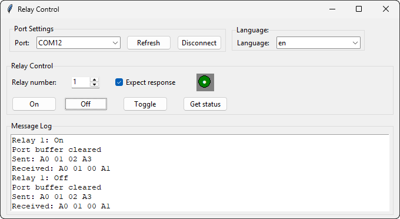
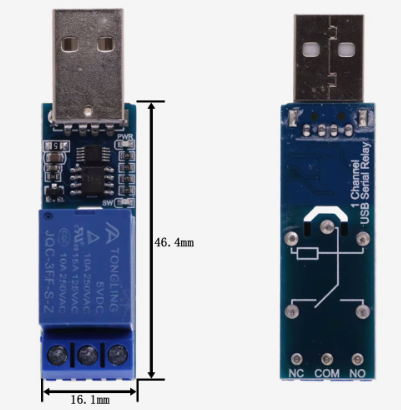
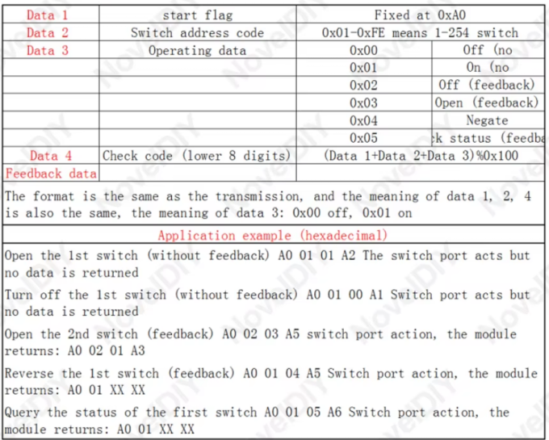

# Relay Control Application

## Overview

This Python application provides a graphical interface for controlling relay modules that use the serial communication protocol described in the documentation. The application supports both English and Russian languages and remembers the last used settings.

## Application Screenshot

## Relay Photo

## Control protocol


## Features

- **Serial Communication**: Controls relays via serial port using a specific protocol
- **Multi-language Support**: Switch between English and Russian interfaces
- **Visual Feedback**: Color-coded indicator shows relay status (red=on, green=off)
- **Port Management**: Automatic port detection and buffer clearing
- **Command History**: Logs all sent and received commands
- **Persistent Settings**: Remembers last used port, relay number, and language

## Usage

### Connection Setup
1. Select your COM port from the dropdown
2. Click "Connect" to establish the connection
3. The indicator will turn gray when disconnected


### Controlling Relays
1. Enter the relay number (1-254)
2. Choose an action:
   - **On**: Turn relay on
   - **Off**: Turn relay off
   - **Toggle**: Reverse relay state
   - **Get Status**: Query current relay status
3. Check "Expect response" if you want to wait for module feedback


### Language Switching
Use the language dropdown to switch between English and Russian interfaces. The selected language will be saved for future sessions.

## Requirements

- Python 3.x
- Required packages:
  ```
  pip install pyserial
  ```

## Configuration

The application automatically creates a `relay_config.json` file that stores:
- Last used COM port
- Last used relay number
- Language preference
- Connection status
- Custom translations (if modified)

## Troubleshooting

If you experience communication issues:
1. Verify the correct COM port is selected
2. Check the cable connection
3. Ensure the relay module is powered on
4. Try clearing the port buffer by reconnecting

The message log displays all communication attempts and errors for debugging.
